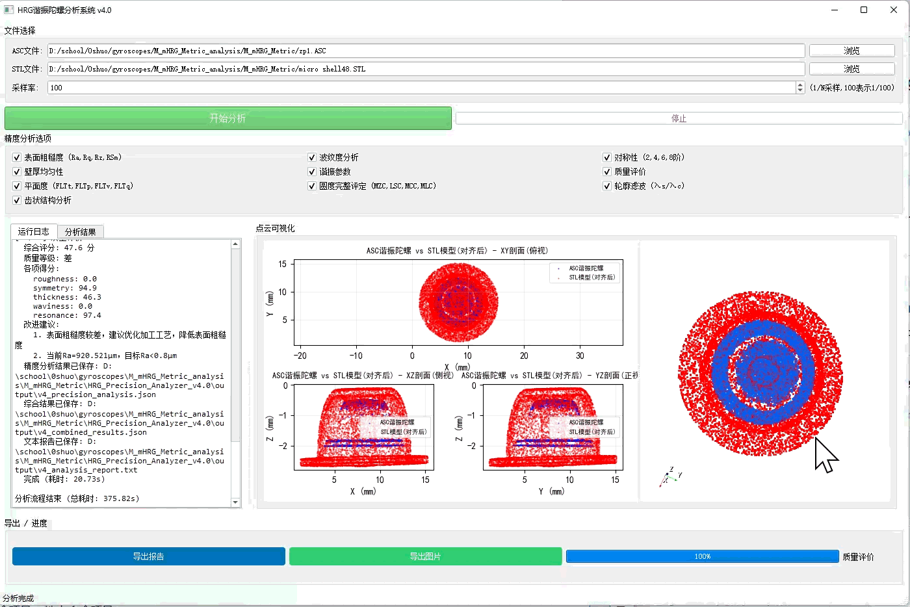

# HRG_Precision_Analyzer
## 概述
HRG谐振陀螺加工精度分析系统上位机软件，实现谐振子自动化检测与质量评价
	(1)软件模块化架构搭建：Python 搭建分层业务框架，实现粗糙度、圆度、壁厚、齿状结构、综合质量评价共 10 大分析模块，对接国标检测指标；支持文件智能识别，自动区分仿真数据与陀螺实测数据，调度对应分析流程。
	(2)2D/3D 可视化交互开发：基于 VTK 完成三维点云交互渲染，支持实测点云与 STL 模型双模型比对；matplotlib 实现二维剖面可视化，支持缩放选点查看局部几何偏差。
	(3)陀螺专用业务流水线开发：实现点云分割、装配误差解算、数据自动清理、多策略模型对齐；完成齿结构全套参数计算，输出 0 100 分综合质量评分、质量等级及工艺改进建议。
	(4)报告导出与系统验证：支持 PDF/Word 检测报告一键导出；基于 22 组仿真测试样本，注入多维度偏差参数完成整套软件功能验证；底层兼容多格式点云，集成基础预处理与配准算法提供计算支撑。
## 简介

本系统对 ASC 点云文件执行完整的多指标精度分析，支持与 STL 模型的 ICP 对齐对比，
提供交互式 GUI 界面进行参数配置、实时可视化和多格式报告导出。

## 目录结构

```
HRG_Precision_Analyzer_v4.0/
├── 启动.bat                    # 一键启动脚本
├── run_gui_v4.py               # GUI 主入口
├── requirements.txt            # Python 依赖
├── advanced_alignment.py       # ICP 配准 + 多策略对齐
├── config/
│   └── default_config.yaml     # 默认分析参数配置
├── core/                       # 核心分析引擎
│   ├── base_analyzer.py        # 基础分析器和数据结构
│   ├── precision_analyzer.py   # 精度分析主分析器
│   ├── roughness_analyzer.py   # 表面粗糙度 (GB/T 3505)
│   ├── waviness_analyzer.py    # 波纹度 (GB/T 3505)
│   ├── flatness_analyzer.py    # 平面度 (GB/T 24630)
│   ├── roundness_full_analyzer.py  # 圆度完整评定 (GB/T 7235)
│   ├── profile_filter_analyzer.py  # 轮廓滤波 (GB/T 6062)
│   ├── symmetry_analyzer.py    # 对称性分析
│   ├── thickness_analyzer.py   # 壁厚分析
│   ├── resonance_analyzer.py   # 谐振参数分析
│   ├── quality_evaluator.py    # 质量评价
│   └── advanced_algorithms.py  # 高级几何评定算法
├── gui/                        # GUI 界面
│   ├── hrg_precision_analyzer_gui_v4.py  # v4 主界面 (VTK 3D 可视化)
│   ├── hrg_complete_analyzer_gui_v3.py   # v3 父类 (基础可视化)
│   └── hrg_complete_analyzer_gui_v3_with_export.py  # v3 导出父类
├── report_export/              # 报告导出模块
├── output/                     # 分析结果输出目录
└── test_import.py              # 依赖检查脚本
```

## 环境要求

- **Python**: 3.8+
- **操作系统**: Windows 10/11
- **推荐**: Anaconda/Miniconda

## 安装步骤

### 方式一：一键安装 (Anaconda)

```bash
conda create -n hrg python=3.10
conda activate hrg
pip install -r requirements.txt
```

### 方式二：pip 直接安装

```bash
pip install -r requirements.txt
```

### VTK 安装 (3D 对比可视化)

VTK 用于 3D 点云交互式对比可视化。若未安装，系统自动降级为 matplotlib 渲染。

```bash
pip install vtk
```

> 若 vtk 安装失败，可尝试: `conda install -c conda-forge vtk`

## 启动方式

### 方式一：双击启动
双击 `启动.bat`

### 方式二：命令行启动
```bash
python run_gui_v4.py
```

## 使用流程

1. **加载 ASC 文件** — 点击"选择ASC文件"按钮，选择待分析的点云文件
2. **加载 STL 模型**（可选） — 用于对比分析
3. **配置分析选项** — 勾选需要的分析项目（3×3 横排布局）
4. **开始分析** — 点击"开始分析"，进度条实时更新
5. **查看结果** — 左侧"分析结果"标签页查看数值结果
6. **点云可视化** — 右侧可视化区域查看 2D 剖面图和 3D 对比
7. **导出报告** — 底部"导出报告"按钮，支持 Word/PDF/TXT/批量导出

## 分析指标

| 指标 | 标准依据 | 说明 |
|------|----------|------|
| 表面粗糙度 | GB/T 3505 | Ra, Rq, Rz, RSm |
| 波纹度 | GB/T 3505 | W 参数族 |
| 平面度 | GB/T 24630 | FLTt, FLTp, FLTv, FLTq |
| 圆度 | GB/T 7235 | MZC, LSC, MCC, MLC |
| 轮廓滤波 | GB/T 6062 | λs/λc 滤波 |
| 对称性 | — | 2,4,6,8 阶 |
| 壁厚 | — | 均匀性分析 |
| 谐振参数 | — | 频率/阻尼 |
| 质量评价 | — | 综合评级 |

## 可视化说明

- **单点云模式**: 2×2 布局 (XY俯视、XZ侧视、YZ正视、3D视图)
- **对比模式**: 左侧 matplotlib (XY全宽 + XZ/YZ并排) + 右侧 VTK 3D 交互
- **VTK 降级**: 若 VTK 未安装，对比模式自动降级为纯 matplotlib 2×2

## 导出格式

- **Word (.docx)**: 详细分析报告，含表格和图表
- **PDF (.pdf)**: 排版报告
- **TXT (.txt)**: 纯文本结果
- **批量导出**: 同时生成多种格式
- **可视化图片 (.png)**: 300 DPI 高清截图

## 技术架构

- **统一分析流程**: UnifiedAnalysisWorker + 15步 StepDef 声明式注册
- **VTK 3D 渲染**: vtkVertexGlyphFilter + 白色背景 + 延迟渲染保护
- **布局管理**: LayoutMode 枚举驱动，QSplitter 动态方向切换
- **导出架构**: QMenu 下拉菜单 + 父类导出逻辑复用
- **SVD 安全**: full_matrices=False 防止内存溢出

## 故障排除

| 问题 | 解决方案 |
|------|----------|
| 启动失败 | 运行 `pip install -r requirements.txt` |
| VTK 黑屏 | 确认 vtk>=9.0 已安装，重启程序 |
| 内存不足 | 减少降采样点数，关闭其他程序 |
| 导出 Word 失败 | 确认 python-docx>=0.8.11 已安装 |
| 中文乱码 | 系统需支持中文编码，终端运行 chcp 65001 |

## Demo


> 演示内容：实测点云与STL振子模型配准，2D剖面偏差可视化，齿状结构参数求解，自动生成综合质量评分。
